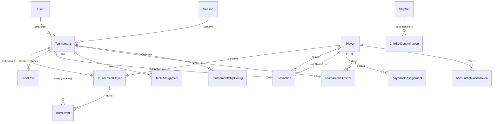

# Audit Technique - WPT Villelaure (Poker Championship)

**Date de l'audit**: 17 janvier 2026
**Version analysée**: 0.1.0
**Environnement de production**: Fly.io (app: wpt-villelaure)

---

## 1. Fiche d'Identité

### Stack Technique

| Composant | Technologie | Version |
|-----------|-------------|---------|
| **Framework** | Next.js | 16.1.1 |
| **Runtime** | Node.js | 20 (Alpine) |
| **Frontend** | React | 19.2.0 |
| **Langage** | TypeScript | 5.x |
| **Base de données** | SQLite | Via Prisma |
| **ORM** | Prisma | 6.19.0 |
| **Authentification** | NextAuth.js | 5.0.0-beta.30 |
| **Temps réel** | Socket.IO | 4.8.1 |
| **Styling** | Tailwind CSS | 4.x |
| **UI Components** | Radix UI | Multiple |
| **Hébergement** | Fly.io | Region: cdg (Paris) |

### Dépendances Principales

```
@prisma/client       6.19.0   - ORM pour SQLite
next-auth            5.0.0-beta.30 - Authentification (BETA)
socket.io            4.8.1    - WebSockets temps réel
bcryptjs             3.0.3    - Hachage mots de passe
zod                  4.1.12   - Validation de schémas
recharts             3.3.0    - Graphiques/statistiques
html2canvas          1.4.1    - Export images
jspdf                3.0.3    - Export PDF
@anthropic-ai/sdk    0.68.0   - IA (génération messages)
@google-cloud/text-to-speech 6.4.0 - TTS pour annonces
```

---

## 2. Schéma d'Architecture

### Architecture Globale

```
┌─────────────────────────────────────────────────────────────────┐
│                        PRODUCTION (Fly.io)                       │
├─────────────────────────────────────────────────────────────────┤
│  ┌─────────────────────────────────────────────────────────┐    │
│  │                    Docker Container                      │    │
│  │  ┌───────────────────────────────────────────────────┐  │    │
│  │  │              Custom Node.js Server                 │  │    │
│  │  │  ┌─────────────────┐  ┌──────────────────────┐   │  │    │
│  │  │  │   Next.js App   │  │    Socket.IO Server   │   │  │    │
│  │  │  │   (SSR + API)   │  │   (path: /api/socketio)│   │  │    │
│  │  │  └────────┬────────┘  └───────────┬──────────┘   │  │    │
│  │  │           │                       │               │  │    │
│  │  │           └───────────┬───────────┘               │  │    │
│  │  │                       │                           │  │    │
│  │  │              ┌────────▼────────┐                  │  │    │
│  │  │              │   Prisma ORM    │                  │  │    │
│  │  │              └────────┬────────┘                  │  │    │
│  │  └───────────────────────┼───────────────────────────┘  │    │
│  └──────────────────────────┼──────────────────────────────┘    │
│                             │                                    │
│  ┌──────────────────────────▼──────────────────────────────┐    │
│  │              Volume Persistant (poker_data)              │    │
│  │                    /data/dev.db (SQLite)                 │    │
│  │                    Taille: 1 GB                          │    │
│  └──────────────────────────────────────────────────────────┘    │
└─────────────────────────────────────────────────────────────────┘
```

### Flux de Données

```
┌──────────┐     HTTPS      ┌──────────────┐    ┌─────────────┐
│  Client  │ ◄────────────► │  Next.js API │ ◄─►│   Prisma    │
│  (PWA)   │                │   Routes     │    │   (SQLite)  │
└────┬─────┘                └──────────────┘    └─────────────┘
     │
     │ WebSocket
     │ (Socket.IO)
     ▼
┌──────────────┐
│  Real-time   │  Événements: timer, éliminations, tables
│    Updates   │
└──────────────┘
```

### Points d'Entrée

| Route | Description |
|-------|-------------|
| `/` | Page d'accueil (redirection) |
| `/login` | Authentification admin |
| `/dashboard/*` | Interface d'administration |
| `/player/*` | Interface joueur (PWA) |
| `/director/*` | Interface directeur de tournoi |
| `/tv/*` | Affichage TV (timer, tables) |
| `/api/*` | API REST |

---

## 3. Modèle de Données

### Entités Principales et Relations



### Détail des Entités

| Entité | Rôle | Champs clés |
|--------|------|-------------|
| **User** | Compte admin système | email, password, role |
| **Player** | Joueur du championnat | nickname, email, password, status, role |
| **Season** | Saison de championnat | year, status, pointsConfig, penalties |
| **Tournament** | Tournoi | date, status, buyIn, startingChips, prizePool |
| **TournamentPlayer** | Participation | finalRank, rebuysCount, totalPoints, prizeAmount |
| **BlindLevel** | Structure blindes | level, smallBlind, bigBlind, ante, duration |
| **Elimination** | Élimination définitive | rank, level, isLeaderKill |
| **BustEvent** | Perte de tapis (période recaves) | level, recaveApplied |
| **ChipSet** | Mallette de jetons | name, denominations |

### Système de Rôles (RBAC)

```
PlayerRole enum:
├── PLAYER              - Joueur standard
├── TOURNAMENT_DIRECTOR - Directeur de tournoi (scope: tournoi assigné)
├── ANIMATOR            - Animateur (TV, annonces)
└── ADMIN               - Administrateur complet

Multi-rôles via PlayerRoleAssignment (1 joueur peut avoir N rôles)
TD scope via TournamentDirector (1 TD assigné à N tournois)
```

---

## 4. Configuration Production (Fly.io)

### fly.toml

```toml
app = "wpt-villelaure"
primary_region = "cdg"  # Paris

[env]
  NODE_ENV = "production"
  PORT = "3003"

[http_service]
  internal_port = 3003
  force_https = true
  auto_stop_machines = false
  auto_start_machines = true
  min_machines_running = 1

[[vm]]
  memory = '512mb'
  cpu_kind = 'shared'
  cpus = 1

[[mounts]]
  source = "poker_data"
  destination = "/data"
  initial_size = "1gb"
```

### Variables d'Environnement Requises

| Variable | Description | Critique |
|----------|-------------|----------|
| `DATABASE_URL` | `file:/data/dev.db` | OUI |
| `AUTH_SECRET` | Secret NextAuth.js | OUI |
| `AUTH_URL` / `NEXTAUTH_URL` | URL de l'application | OUI |
| `NODE_ENV` | `production` | OUI |
| `PORT` | `3003` | OUI |
| `GOOGLE_APPLICATION_CREDENTIALS` | Clé TTS (optionnel) | NON |
| `ANTHROPIC_API_KEY` | Clé IA (optionnel) | NON |

### Processus de Déploiement

```bash
# 1. Build Docker multi-stage
# 2. Push vers registry Fly.io
# 3. docker-entrypoint.sh:
#    - mkdir -p /data
#    - npx prisma migrate deploy  # Migrations automatiques
#    - npm start
```

---

## 5. Dette Technique

### Critique (Action immédiate requise)

| ID | Description | Impact | Fichier(s) |
|----|-------------|--------|------------|
| **DT-001** | **NextAuth.js en version BETA** (5.0.0-beta.30) | Risque de breaking changes, API non stable | package.json |
| **DT-002** | **Email non implémenté en production** | Invitations joueurs ne fonctionnent pas | src/lib/email.ts:33 |
| **DT-003** | **263 console.log dans le code source** | Fuite d'informations, pollution logs prod | 30 fichiers |
| **DT-004** | **SQLite en production** | Pas de backup automatique, pas de réplication, un seul writer | prisma/schema.prisma |

### Moyen (Planifier dans les prochaines semaines)

| ID | Description | Impact | Fichier(s) |
|----|-------------|--------|------------|
| **DT-005** | Prisma 7.x disponible (actuellement 6.19) | Nouvelles features, sécurité | package.json |
| **DT-006** | React 19.2.3 disponible (actuellement 19.2.0) | Corrections de bugs | package.json |
| **DT-007** | 24 dépendances avec mises à jour disponibles | Sécurité, stabilité | npm outdated |
| **DT-008** | README.md obsolète (mentionne PostgreSQL) | Documentation incorrecte | README.md |
| **DT-009** | next-pwa peut causer des problèmes de cache | PWA cache agressif | next.config.ts |

### Mineur (Amélioration continue)

| ID | Description | Impact | Fichier(s) |
|----|-------------|--------|------------|
| **DT-010** | Code DEBUG laissé dans tests | Pollution logs CI | scripts/recipe/tech-runner.spec.ts |
| **DT-011** | Fichiers de session/reprise nombreux | Encombrement repo | SESSION_*.md |
| **DT-012** | Images volumineuses dans le repo | Taille clone git | *.jpg, *.jpeg |

---

## 6. Couverture de Tests

### Tests Unitaires (Jest)

```
Fichiers de test: 41 fichiers .test.ts
Couverture: API routes, lib functions, RBAC, auth

Catégories testées:
├── API Routes (17 fichiers)
│   ├── tournaments, players, seasons
│   ├── auth (invite, activate)
│   ├── RBAC (permissions)
│   └── timer, blinds, eliminations
├── Lib Functions (4 fichiers)
│   ├── blindGenerator
│   ├── permissions
│   ├── scoring
│   └── leaderboard
├── Auth (3 fichiers)
└── Exports (1 fichier)
```

### Tests E2E (Playwright)

```
Fichiers: 2 specs
├── finish-flow.spec.ts  - Flux complet tournoi (création → fin)
└── tech-runner.spec.ts  - Scénarios techniques
```

### CI/CD (GitHub Actions)

```yaml
Jobs:
├── unit-tests     - npm test
└── e2e-finish-flow - Playwright (dépend de unit-tests)

Trigger: push/PR sur master
```

---

## 7. Procédure de Backup

### État Actuel

| Méthode | Statut | Fréquence |
|---------|--------|-----------|
| Snapshots Fly.io | ACTIF | Automatique quotidien |
| Backup manuel SSH | DOCUMENTÉ | Avant déploiement |
| Export local | NON AUTOMATISÉ | Ad-hoc |

### Procédure Documentée

Le fichier `docs/PROD_BACKUP_RESTORE.md` contient une procédure validée (testée 2025-12-30):

```bash
# Lister les snapshots
fly volumes snapshots list <volume_id> -a wpt-villelaure

# Backup manuel
fly ssh console -a wpt-villelaure \
  -C "sqlite3 /data/dev.db '.backup /data/backup-$(date +%Y%m%d).db'"

# Télécharger
fly sftp get /data/backup-*.db -a wpt-villelaure

# Restauration (15-20 min)
fly volumes create poker_data --snapshot-id <ID> -a wpt-villelaure
```

### Recommandations Backup

| Action | Priorité | Effort |
|--------|----------|--------|
| Configurer rétention snapshots à 60+ jours | HAUTE | 5 min |
| Automatiser backup avant chaque tournoi | HAUTE | 30 min |
| Stocker backups hors Fly.io (S3/GCS) | MOYENNE | 2h |
| Script de vérification intégrité post-backup | MOYENNE | 1h |

---

## 8. Points de Vigilance pour Évolutions

### Migrations de Base de Données

```
11 migrations appliquées:
├── 0_init                                    - Schéma initial
├── 20251230_add_blind_level_is_rebuy_end    - Flag fin recaves
├── 20260101_rbac_multirole_tournament...    - Système RBAC
├── 20260101_invite_account_activation...    - Tokens activation
├── 20260101_prize_pool_payouts_v1           - Distribution gains
├── 20260101_tournament_rebuy_rules_v1       - Règles recaves
├── 20260101_unique_constraint_...           - Contrainte rang unique
├── 20260111_add_bust_event                  - Événements bust
├── 20260112_add_dynamic_recave_penalty...   - Paliers pénalités
├── 20260115_add_detailed_points_config      - Barème points détaillé
└── 20260116_add_recave_applied_to_bust...   - Traçabilité recave
```

**Gestion**: `prisma migrate deploy` automatique au démarrage (docker-entrypoint.sh)

### Couplages Forts

| Zone | Description | Risque |
|------|-------------|--------|
| `server.js` | Custom server Node.js avec Socket.IO global | Difficile à tester, couplage fort |
| `TournamentPlayer` | Calcul de points inline | Logique métier dispersée |
| `Season.pointsConfig` | JSON non typé pour barèmes | Validation manuelle |
| `global.io` | Instance Socket.IO globale | Anti-pattern, difficile à mocker |

### Risques de Perte de Données

| Scénario | Probabilité | Impact | Mitigation |
|----------|-------------|--------|------------|
| Volume Fly.io supprimé | Faible | CRITIQUE | Snapshots + backups externes |
| Migration Prisma échouée | Moyenne | ÉLEVÉ | Backup pré-déploiement |
| Corruption SQLite | Faible | CRITIQUE | PRAGMA integrity_check régulier |
| Déploiement pendant tournoi | Possible | MOYEN | Planifier déploiements hors tournois |

---

## 9. Recommandations

### Actions Immédiates (Avant prochain tournoi)

1. **Configurer rétention snapshots Fly.io à 60 jours**
   ```bash
   fly volumes update <vol_id> --snapshot-retention 60 -a wpt-villelaure
   ```

2. **Créer un backup manuel de la saison 2026**
   ```bash
   fly ssh console -a wpt-villelaure \
     -C "sqlite3 /data/dev.db '.backup /data/saison2026-backup.db'"
   fly sftp get /data/saison2026-backup.db -a wpt-villelaure
   ```

3. **Vérifier intégrité de la base actuelle**
   ```bash
   fly ssh console -a wpt-villelaure \
     -C "sqlite3 /data/dev.db 'PRAGMA integrity_check'"
   ```

### Actions Court Terme (1-2 semaines)

1. **Nettoyer les console.log** - Créer un logger centralisé avec niveaux
2. **Mettre à jour les dépendances non-breaking** (patch/minor versions)
3. **Implémenter l'envoi d'emails** (Resend ou SendGrid)
4. **Mettre à jour le README.md** avec la vraie stack (SQLite, Fly.io)

### Actions Moyen Terme (1-3 mois)

1. **Évaluer migration vers PostgreSQL** pour scaling et backups automatisés
2. **Stabiliser NextAuth.js** - Surveiller la sortie de la version stable
3. **Refactorer `server.js`** - Séparer Socket.IO dans un module testable
4. **Automatiser les backups** avec script cron ou GitHub Action

### Actions Long Terme

1. **Monitoring/Alerting** - Configurer des alertes Fly.io
2. **Documentation API** - OpenAPI/Swagger pour les routes
3. **Tests de charge** - Valider le comportement avec N joueurs simultanés

---

## 10. Annexes

### A. Arborescence Simplifiée

```
poker-championship/
├── prisma/
│   ├── schema.prisma        # Modèle de données
│   ├── migrations/          # 11 migrations SQL
│   └── seed*.ts             # Scripts de peuplement
├── src/
│   ├── app/
│   │   ├── api/             # 40+ routes API
│   │   ├── dashboard/       # Interface admin
│   │   ├── player/          # Interface joueur
│   │   ├── director/        # Interface TD
│   │   └── tv*/             # Vues TV (v1, v2, v3)
│   ├── components/          # Composants React
│   ├── lib/                 # Utilitaires (auth, prisma, scoring)
│   ├── hooks/               # React hooks custom
│   └── __tests__/           # Tests unitaires
├── scripts/
│   ├── db/                  # Scripts DB (reset, purge)
│   └── recipe/              # Tests E2E Playwright
├── docs/                    # Documentation technique
├── fly.toml                 # Config Fly.io
├── Dockerfile               # Build multi-stage
└── server.js                # Custom server Node.js + Socket.IO
```

### B. Commandes Utiles

```bash
# Développement
npm run dev                  # Serveur de dev
npm run db:studio            # Interface Prisma
npm test                     # Tests unitaires

# Base de données
npm run db:migrate:dev       # Nouvelle migration (dev)
npm run db:migrate:deploy    # Appliquer migrations (prod)
npm run db:seed              # Peupler données initiales

# Production
fly deploy -a wpt-villelaure           # Déploiement
fly logs -a wpt-villelaure             # Logs temps réel
fly ssh console -a wpt-villelaure      # Accès SSH
fly status -a wpt-villelaure           # État de l'app

# Backup
fly volumes snapshots list <vol_id>    # Liste snapshots
fly sftp get /data/dev.db              # Télécharger DB
```

### C. Contacts / Ressources

- **Documentation Fly.io**: https://fly.io/docs
- **Prisma SQLite**: https://www.prisma.io/docs/orm/overview/databases/sqlite
- **NextAuth.js v5**: https://authjs.dev (beta docs)
- **Cahier des charges**: `cahier_des_charges_poker_championship.md`
- **Procédure backup**: `docs/PROD_BACKUP_RESTORE.md`
- **Matrice RBAC**: `docs/RBAC_MATRIX.md`

---

*Rapport généré le 17 janvier 2026 par Claude Code*
